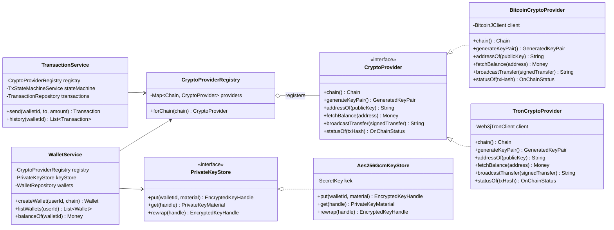

# CryptoProvider abstraction

The class diagram for the `CryptoProvider` extraction
(`REFACTOR-CRYPTO-PROVIDER`). Application services depend on the
interface; the registry resolves the right implementation per `Chain`.

**Notes**

- `WalletService` and `TransactionService` never reference
  `BitcoinCryptoProvider` or `TronCryptoProvider` by name. Tests substitute
  an `InMemoryCryptoProvider` via the registry.
- Every method on `CryptoProvider` operates on `domain.*` types. No
  BitcoinJ or Web3j types leak through the interface.
- A future `EthereumCryptoProvider` would land as a third implementation
  with no change to the interface or its callers — but that is explicitly
  out of scope for the current sprint (see `ARCHITECTURE.md` §8).
