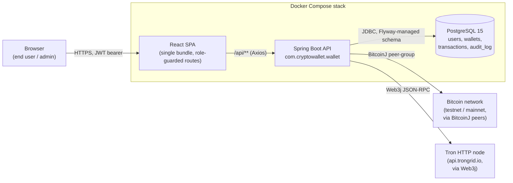

# System context

End-to-end view of how a browser request reaches a confirmed on-chain
transaction in the post-refactor architecture. Two external networks
(Bitcoin testnet/mainnet and the Tron HTTP node) sit on the right; the
deployment boundary (Docker Compose stack) is the dashed group on the
left.

**Notes**

- The SPA is served by its own container (Nginx serving the CRA/Vite
  build); the Spring Boot API does not serve static assets. The arrow
  from `Browser → SPA` and `SPA → API` are separate hops.
- Auth is stateless JWT; the `Authorization: Bearer <token>` header is
  attached by `lib/api.ts`'s Axios interceptor.
- Outbound connections to BTC and Tron networks are the only
  reaches outside the Compose stack.
- The H2 in-memory database used in `dev` is intentionally not shown — it
  is dev-only and lives inside the API process.
