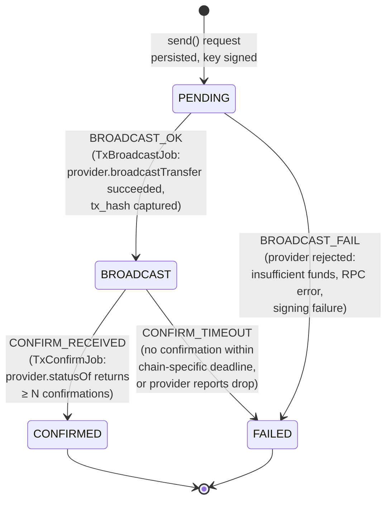

# Transaction state machine

Explicit four-state lifecycle introduced in `REFACTOR-TX-STATE-MACHINE`.
Every transition is driven by a named `TxEvent`; the wrapper service
persists the new state and writes an `audit_log` row in the same database
transaction.

**Transition table** (canonical — `TxStateMachine.next` is a `switch` over
this exact set):

| From | Event | To |
| --- | --- | --- |
| `PENDING` | `BROADCAST_OK` | `BROADCAST` |
| `PENDING` | `BROADCAST_FAIL` | `FAILED` |
| `BROADCAST` | `CONFIRM_RECEIVED` | `CONFIRMED` |
| `BROADCAST` | `CONFIRM_TIMEOUT` | `FAILED` |

Any `(state, event)` pair not listed throws `IllegalTransitionException`.
`CONFIRMED` and `FAILED` are terminal — no further events are accepted.

**Job ownership**

- `TxBroadcastJob` (scheduled, ~5s) selects rows where `state='PENDING'`,
  calls `CryptoProvider.broadcastTransfer`, fires `BROADCAST_OK` or
  `BROADCAST_FAIL`.
- `TxConfirmJob` (scheduled, ~30s) selects rows where `state='BROADCAST'`,
  calls `CryptoProvider.statusOf`, fires `CONFIRM_RECEIVED` once the
  per-chain confirmation threshold is met (BTC: configurable, default 3
  testnet / 6 mainnet; Tron: 19 blocks ≈ 57s).
- `CONFIRM_TIMEOUT` is a guard inside `TxConfirmJob`: if a transaction has
  been in `BROADCAST` for longer than `crypto.confirm-deadline.<chain>`
  (default 24h), the job fires `CONFIRM_TIMEOUT` and writes the chain
  provider's last-known status into `transactions.error_message`.

**Audit trail**

Every transition writes an `audit_log` row with
`action = 'TX_<EVENT_NAME>'`, `target_type = 'transaction'`,
`target_id = <tx_id>`, and a `payload` containing
`{from, to, event, txHash?, errorMessage?}`. This is the only mechanism
by which transaction state changes are recorded — direct UPDATEs to
`transactions.state` outside `TxStateMachineService` are forbidden by
convention and caught in code review.
